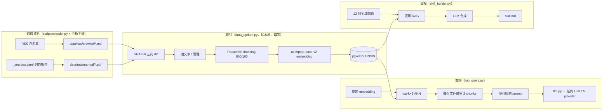

# startup-trends-rag

一套可以換資料、換模型的個人 RAG：把 VC 部落格文章和產業報告變成向量知識庫，用任何 LLM 回答「2024–2026 年早期新創投資趨勢」的問題，並把整個知識庫蒸餾成一份 AI agent 可直接載入的 `skill.md`。

pgvector + 本地 embedding + LiteLLM。跑在筆電上，不需要付費 API——預設用 Ollama。

`skill.md` 裡的一段（由系統自動生成，`[#]` 是可追溯到原文的引用）：

> From 2024 to 2026, early-stage startup investment is heavily influenced by AI, which enables startups to build products with less capital [6, 7]. In 2024, the median early-stage deal valuation reached a record $25 million, with investors actively participating in these rounds [7]. By December 2025, nontraditional investors, driven by AI megadeals, accounted for 63.4% of early-stage VC deal value [2].

## 它解決什麼問題

LLM 的訓練資料對「現在的 VC 在想什麼」永遠是過時的。這個專案讓你維護一份自己挑選的來源清單（RSS 白名單 + 手動下載的報告），定期增量更新索引，問答時每個主張都帶 `[#]` 引用回到原文。最後 `skill_builder.py` 用 13 個全域問題把知識庫掃一遍，合成一份帶引用的 `skill.md`——這份檔案可以直接餵給 Claude Code / 其他 agent 當作領域技能，不用每次都跑 RAG。

## 架構



| 檔案 | 職責 | 碰網路？ |
|---|---|---|
| `scripts/crawler.py` | 從 `config.RSS_SOURCES` 白名單抓 2024 年後的文章成 Markdown（含 front matter） | 是 |
| `data_update.py` | `data/raw/` → 清理 → chunk → embed → pgvector；用內容 SHA256 做新增/變更/刪除三向 diff | 否 |
| `rag_query.py` | 檢索 + 生成，單次或互動模式，`--no-llm` 只看檢索結果 | 只有 LLM 呼叫 |
| `llm.py` | 所有 LLM 呼叫的唯一入口：Ollama / OpenAI / Gemini / Anthropic / 任何 OpenAI-compatible server | 是 |
| `skill_builder.py` | 跑全域問題、合成 `skill.md` | 只有 LLM 呼叫 |
| `eval_retrieval.py` | 用 `eval/questions.yaml` 量 hit@k 與 MRR，比較有無 per-document cap | 否 |

## 快速開始

```bash
# 1. 環境（Python 3.10+）
pip install -r requirements.txt

# 2. LLM：預設用本地 Ollama；要換 OpenAI / Gemini / 自架 server 就改 .env
cp .env.example .env
ollama pull llama3.1
python scripts/check_llm.py            # 應回 "pong"

# 3. 向量資料庫
docker compose up -d                   # pgvector/pgvector:pg16，schema 在 docker/init.sql

# 4. 資料：跑爬蟲 + 依 data/raw/manual/_sources.yaml 下載報告（見 data/README.md）
python scripts/crawler.py
python data_update.py --rebuild

# 5. 問
python rag_query.py --query "How do VCs think about AI agent pricing?"
python rag_query.py                    # 互動模式，保留最近 5 輪對話

# 6. 量檢索品質、蒸餾成 skill.md
python eval_retrieval.py
python skill_builder.py --output skill.md
```

換模型只要改 `.env` 的一行：

```dotenv
LLM_MODEL=ollama/llama3.1                 # 本地
LLM_MODEL=openai/gpt-4o-mini              # + OPENAI_API_KEY
LLM_MODEL=gemini/gemini-2.5-flash         # + GEMINI_API_KEY
LLM_MODEL=openai/<name>                   # + LLM_API_BASE / LLM_API_KEY：vLLM、LM Studio、LiteLLM proxy…
```

或在命令列 `--model` 覆蓋。第一次執行會下載 ~420 MB 的 embedding 模型，之後離線。

## 設計決策

**Chunking：Recursive Character Splitting，800 / 100。** VC 文章的單一論點通常 300–800 字元，800 能裝下完整論點加一點上下文；overlap 100（12.5%）確保切在邊界上的句子在相鄰 chunk 有完整版本。

**Embedding：`all-mpnet-base-v2` 本地執行。** 免費、離線、可重現。資料 95% 是英文，mpnet（768 維）在長段落召回率上明顯優於 MiniLM（384 維）；`normalize_embeddings=True` 配合 pgvector 的 cosine 運算。

**Vector DB：pgvector + HNSW。** 能跟 SQL metadata 過濾結合，Docker 一行起。資料量 < 10k chunks 時 HNSW 召回率比 IVFFlat 高且不需訓練；`m=16, ef_construction=64` 是預設值，現在幾百個 chunks 綽綽有餘。

**Retrieval：per-document diversity cap。** 第一版只用原生 top-k，跑 `skill_builder.py` 時發現「單一來源霸佔」：問 methodology 時 Startup Genome 報告的相鄰 chunks 塞滿整個 top-k，導致 `skill.md` 的 Methodology 章節錯誤聚焦在沙烏地阿拉伯的區域案例。修法是先撈 `top_k × 3`，再讓每份文件最多貢獻 2 個 chunks（`diversify_by_document()`，20 行以內、零依賴）。重跑後 Methodology 改從 Bessemer State of AI 2025 引用四個具體 founder takeaways。`eval_retrieval.py --no-diversity` 可以自己比較兩者。

**冪等索引：SHA256 而非 mtime。** `git clone` 之後 mtime 會被重設，用 mtime 判斷會在別台機器上全部重跑；內容雜湊改一個字都會觸發 reindex，`ON DELETE CASCADE` 讓刪除文件時 chunks 自動清掉。

**Prompt。** System prompt 要求每個主張都引用 `[#]`、找不到就明說、來源矛盾要指出；temperature 0.3。

**`_sources.yaml`。** PDF 內建的 metadata 常常是空的或錯的，所以手動下載的檔案用一份 YAML 對照表提供 title / URL / author / date，索引時 overlay 進 DB，`skill.md` 的引用才有連結可追溯。

**`skill_builder.py` 的 13 個問題。** Overview ×1、Core Concepts ×4、Key Trends ×3、Key Entities ×1、Methodology ×1、Knowledge Gaps ×1、Example Q&A ×2。同一章節用多個不同角度的問題，比一個大問題能拉出更多不同的 chunks。第一版用抽象措辭（「emerging frameworks and mental models」）會打到指標定義而非框架敘述，改成嵌入具體人名與機構名（a16z、Sequoia、Bessemer、Sam Altman）之後檢索明顯準確。

## 資料

倉庫裡**沒有**資料本體——報告與文章的版權屬於原出版者。`data/raw/manual/_sources.yaml` 列出原始語料用了哪 11 份報告 / essay（CB Insights、PitchBook-NVCA、Bessemer、Startup Genome、a16z、Sequoia、Stripe、Sam Altman、Index Ventures）與下載網址，`config.RSS_SOURCES` 列出 7 個爬蟲白名單部落格（Tom Tunguz、AVC、Both Sides of the Table、First Round Review、a16z、NFX、SaaStr）。全部都是公開、無付費牆的內容；爬蟲檢查 robots.txt、每個網域間隔 1 秒，並排除 ToS 禁止爬取的來源。重建方式見 [`data/README.md`](data/README.md)。

`skill.md` 是用原始語料（34 份文件、2024-01 至 2026-04）跑出來的蒸餾結果，留在倉庫當範例輸出。

## 已知限制與下一步

- **抽象問題的檢索仍不穩定**：像「mental models for startup success」這種 query，Sam Altman 與 Stripe 的敘事性文章在向量空間裡排不進 top-k。候選解法：query rewriting / HyDE，或用 metadata 預過濾（`author IN (...)`）再做 ANN。
- **沒有 reranker、沒有 hybrid search**：單階段 ANN + diversity cap。加 cross-encoder（如 `bge-reranker-base`）或 pgvector + 全文檢索的混合，是最直接的下一步；`eval_retrieval.py` 就是為了量這些改動準備的。
- **chunk 參數一體適用**：密集的 PDF 報告理論上應該用比部落格文章更大的 chunk。
- **更新沒有排程**：增量流程是冪等的，但要自己跑 `crawler.py` + `data_update.py`。

設計文件：[`docs/SDD_phase1.md`](docs/SDD_phase1.md)、[`docs/SDD_phase2.md`](docs/SDD_phase2.md)。

## 測試

```bash
python -m pytest            # llm.py 的 provider 解析（不需要 DB 或網路）
python eval_retrieval.py    # 需要 pgvector + 已索引的資料
```

## 授權

MIT（程式碼）。資料來源各自保有其版權。
