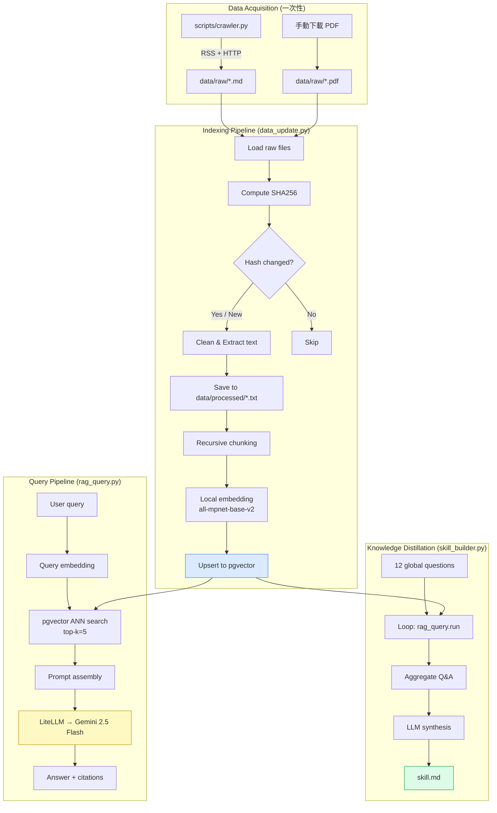
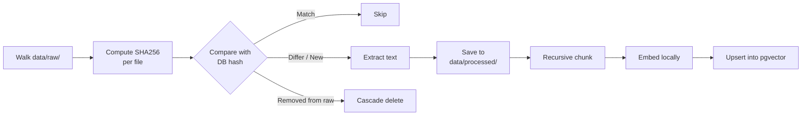

# Software Design Document (SDD)
## HW3 — Personal RAG System: Early-Stage Startup Investment Trends (2024–2026)

> **Project codename**: `startup-trends-rag`
> **Author**: (你的名字)
> **Last updated**: 2026-04-08
> **Document status**: Draft v1.0(對應 Phase 1 開發)

---

## 0. 文件目的

這份 SDD 是這份作業的開發藍圖。寫它的目的有三:

1. **指導開發**:在 Claude / Cursor 上開發時,把這份文件當作 spec 餵給 LLM,可以大幅減少反覆來回。
2. **作為 README 的骨架**:第二階段繳交的 `README.md` 中「設計決策說明」、「系統架構說明」兩節可以直接從本文件抽出來改寫。
3. **強迫自己想清楚**:`data_update.py` 的 idempotency、chunking 策略、retrieval pipeline 這些細節若沒在動工前想清楚,後期 refactor 成本很高。

---

## 1. 專案概述

### 1.1 目標

打造一個聚焦於「2024–2026 年早期新創投資趨勢」的個人化 RAG 系統,最終產出一份可被 Agent 直接使用的 `skill.md` 知識文件。系統需具備:

- **可重複執行的資料 pipeline**:從原始檔案到向量索引完全自動化、idempotent
- **可問答的 CLI 介面**:支援單次與互動式查詢,回答需附引用來源
- **可萃取知識的 skill builder**:自動向 RAG 系統提出全域問題,整合輸出為結構化 skill 文件

### 1.2 知識主題定義

**主題**: Early-Stage Startup Investment Trends, 2024–2026

**範圍邊界**(scope):
- **時間**:2024 年 1 月至今的內容(2023 年以前的內容除非是經典必讀,否則不收)
- **階段**:Pre-seed 到 Series B(早期到成長初期)
- **地理**:全球,但以美國為主(資料密度與品質最高)
- **題材**:投資趨勢、賽道分析、VC 觀點、新興賽道(AI、Climate、Bio、Defense Tech 等)

**非目標**(non-goals):
- 不涵蓋上市公司財報或公開市場分析
- 不涵蓋 PE / Late-stage growth 投資
- 不涵蓋特定公司的詳細 due diligence

### 1.3 設計原則

| 原則 | 說明 |
|---|---|
| **職責分離** | 爬蟲、索引、查詢、知識萃取四個元件嚴格分離,每個元件職責單一 |
| **本地優先** | Embedding 模型在本地跑,降低成本與外部依賴;只有 LLM 對話走 LiteLLM |
| **Idempotent by design** | 任何階段的 pipeline 都可重複執行,結果一致 |
| **資料合規可追溯** | 每筆資料都記錄來源 URL、授權依據、抓取時間 |
| **配置與程式分離** | 所有可調參數集中在 `.env` / `config.py`,程式碼不寫死 magic number |

---

## 2. 系統架構

### 2.1 整體資料流



### 2.2 元件職責

| 元件 | 職責 | 是否碰網路 | CI 是否驗證 |
|---|---|---|---|
| `scripts/crawler.py` | 從白名單來源抓取 2024+ 文章,輸出原始 markdown 到 `data/raw/` | ✅ 是 | ❌ 否(開發者一次性執行) |
| `data_update.py` | 讀 `data/raw/` → 清理 → chunk → embed → 寫入 pgvector | ❌ 否(純本地) | ✅ 是 |
| `rag_query.py` | 接受查詢,執行 retrieval + LLM generation | ⚠️ 僅 LiteLLM call | ✅ 是 |
| `skill_builder.py` | 呼叫 `rag_query` 內部函式,跑全域問題,合成 `skill.md` | ⚠️ 僅 LiteLLM call | ✅ 是(僅 `--help`) |

> 📌 **關鍵設計**:`crawler.py` 與 `data_update.py` **完全解耦**。`crawler.py` 只負責把外部資料抓到 `data/raw/`,跑完就 commit 成果。`data_update.py` 是純本地 pipeline,助教複現時不需要網路、不需要外部 API,大幅降低複現失敗風險。

---

## 3. 資料層設計

### 3.1 目錄結構

```
startup-trends-rag/
├── data/
│   ├── raw/                       ← 原始檔案(commit 進 repo)
│   │   ├── crawled/               ← crawler.py 抓的 .md
│   │   │   ├── a16z_<slug>.md
│   │   │   ├── firstround_<slug>.md
│   │   │   └── ...
│   │   └── manual/                ← 手動下載的 PDF
│   │       ├── bessemer_state_of_cloud_2025.pdf
│   │       └── ...
│   └── processed/                 ← 清理後的純文字(commit 進 repo)
│       ├── a16z_<slug>.txt
│       └── ...
├── scripts/
│   └── crawler.py                 ← 一次性執行的爬蟲
├── data_update.py                 ← 必要檔案
├── rag_query.py                   ← 必要檔案
├── skill_builder.py               ← 必要檔案
├── skill.md                       ← 必要產出
├── config.py                      ← 集中設定常數
├── docker-compose.yml             ← pgvector 啟動
├── requirements.txt
├── .env.example
├── .gitignore
├── README.md
└── docs/
    └── SDD.md                     ← 本文件
```

### 3.2 檔案命名規範

- **Crawled markdown**: `<source>_<slug>.md`,例如 `a16z_big-ideas-2025.md`
- **Manual PDF**: `<publisher>_<report>_<year>.pdf`,例如 `bessemer_state_of_cloud_2025.pdf`
- **Processed text**: 同名,副檔名換成 `.txt`

每個 crawled markdown 檔案的 frontmatter 必須包含:

```yaml
---
source_url: https://a16z.com/big-ideas-in-tech-2025/
title: Big Ideas in Tech 2025
author: a16z
published_date: 2025-01-15
crawled_at: 2026-04-08
license: "Public blog post, fair use for academic purposes"
---
```

### 3.3 爬蟲白名單(crawler.py 的目標)

以下 8 個來源都符合三個條件:**(1) 是公開部落格、無付費牆;(2) 提供 RSS 或穩定的 sitemap;(3) robots.txt 不禁止機器存取**。預估可抓到 35–50 篇 2024 年以後的文章。

| # | 來源 | URL | RSS 端點 | 預估文章數 | 主題側重 |
|---|---|---|---|---|---|
| 1 | **Paul Graham Essays** | `paulgraham.com/articles.html` | (無 RSS,純 HTML index) | 5–10 | 創業哲學、經典必讀 |
| 2 | **Tom Tunguz (Theory Ventures)** | `tomtunguz.com` | `/feed.xml` | 10–15 | SaaS 指標、AI 投資數據 |
| 3 | **AVC (Fred Wilson, USV)** | `avc.com` | `/feed` | 5–10 | 早期投資觀點 |
| 4 | **Both Sides of the Table (Mark Suster)** | `bothsidesofthetable.com` | `/feed` | 3–8 | VC 募資、創業者建議 |
| 5 | **First Round Review** | `review.firstround.com` | `/feed` | 5–8 | 創業者深度訪談 |
| 6 | **a16z Blog** | `a16z.com/news-content/` | `/feed/` | 5–10 | 賽道趨勢報告 |
| 7 | **NfX** | `nfx.com/post` | `/rss` | 3–8 | Network effects、新賽道 |
| 8 | **SaaStr** | `saastr.com` | `/feed` | 3–5 | SaaS 早期成長 |

> ⚠️ **明確排除的來源**(避免 ToS / 法律風險):
> - Y Combinator(blog 與 launches 的 ToS 限制 scraping)
> - Stratechery(付費牆)
> - Bloomberg / FT / The Information(付費牆)
> - Crunchbase / PitchBook 的 listing pages(ToS 禁止 scraping)
> - TechCrunch(內容政策近年趨嚴)

### 3.4 手動下載清單

以下這些是我建議你**手動抓**的高品質報告與特殊內容。它們要嘛是 PDF 報告(爬蟲不適合)、要嘛在 JS 重的 landing page 後面、要嘛 ToS 不允許機器抓取。每份你都會在 README 的「資料來源聲明」表格裡引用。

| # | 名稱 | 來源 | 取得方式 | 為什麼重要 |
|---|---|---|---|---|
| 1 | **Bessemer State of the Cloud(2024 / 2025 兩年)** | `bvp.com/atlas/state-of-the-cloud-2025` | 直接下載 PDF / 整頁存成 PDF | 雲端 SaaS 估值與成長指標的年度權威報告 |
| 2 | **Stripe Annual Letter (2024 / 2025)** | `stripe.com/annual` | 整頁存成 PDF 或 markdown | Patrick Collison 親寫,涵蓋全球早期支付與經濟基礎設施趨勢 |
| 3 | **Startup Genome — Global Startup Ecosystem Report 2025** | `startupgenome.com/reports` | Email 註冊後免費下載 PDF | 全球生態系排名、城市 / 賽道分析 |
| 4 | **CB Insights State of Venture(各季)** | `cbinsights.com/research/report/venture-trends-2024` | Email 註冊後免費 PDF | 全球 VC 募資季度數據,有完整圖表 |
| 5 | **PitchBook–NVCA Venture Monitor** | `nvca.org/research/pitchbook-nvca-venture-monitor/` | 免費 PDF | 美國 VC 市場最權威的季度報告 |
| 6 | **a16z "Big Ideas in Tech" 2024 / 2025 / 2026** | `a16z.com/big-ideas-in-tech-2025/` | 由於是 JS heavy 的單頁,建議印成 PDF | a16z 每年年初的主題預測,直接揭示他們的投資觀點 |
| 7 | **Sequoia "AI's $X Question" 系列** | `sequoiacap.com/article/ais-600b-question/` 等 | 直接存成 markdown | Sequoia 對 AI 投資總體圖景的代表性論述 |
| 8 | **Index Ventures Founder's Handbook 摘要** | `indexventures.com/perspectives/` | 整頁存 PDF | 早期創業者實用知識 |
| 9 | **Sam Altman / Sam Lessin / Elad Gil 的代表性 essays** | 各自部落格 | 手動 copy 成 markdown | 個人型部落格,可選擇性收 2024+ 高引用度文章 |
| 10 | **(可選)Lightspeed / GC / Founders Fund 年度 outlook posts** | 各自網站 | 手動 | 補齊主要 VC 觀點 |

> 💡 **預期總資料量**:爬蟲 35–50 篇 + 手動 10–15 份 = **45–65 份**,遠超作業 20 份的下限。資料規模是 AI 評分「資料收集品質與深度(15%)」這項的關鍵。

### 3.5 合規依據

所有資料來源都屬於以下類別之一,在 README 的資料來源聲明表中明確標註:

- **公開部落格**:作者主動公開於網路、無付費牆、用於學術研究的合理使用
- **CC 授權**:創用 CC 系列授權內容
- **政府/法人公開報告**:NVCA、Startup Genome 等公開發行的免費報告
- **個人著作**:你自己寫的內容(若有)

---

## 4. `scripts/crawler.py` 設計

### 4.1 技術選型

| 套件 | 用途 | 選擇理由 |
|---|---|---|
| `httpx[http2]` | HTTP client | 支援 async + HTTP/2,比 requests 快 2–3 倍,API 設計與 requests 幾乎一致 |
| `feedparser` | RSS / Atom 解析 | 業界標準,handle 各種 broken feed 的 edge case |
| `trafilatura` | 主文擷取 + HTML→Markdown | **這個套件是這支爬蟲的關鍵**。它自動剝除 nav/footer/廣告/留言/相關文章列表,輸出乾淨的 markdown,評測上 F1 分數遠優於 readability-lxml 與 newspaper3k |
| `python-dateutil` | 日期解析(過濾 2024+) | 處理各種日期格式 |
| `tenacity` | 重試 | 網路爬蟲必備 |

> 💡 **為什麼用 trafilatura 而不是 BeautifulSoup**:你不會想花一個下午處理 a16z 那種 React-rendered 頁面的 DOM 結構。trafilatura 是專門解這個問題的學術級工具(由 Adrien Barbaresi 維護,有 ACL 論文背書),`extract()` 一行搞定。它本身會處理 boilerplate removal、語言偵測、metadata 抽取,等於把作業要求的「文字清理」這步在爬蟲階段就做掉。

### 4.2 執行流程

```python
# scripts/crawler.py 偽代碼
async def main():
    sources = load_whitelist()  # 從 config.py 讀
    semaphore = asyncio.Semaphore(5)  # 同時最多 5 個請求,做個禮貌的爬蟲

    async with httpx.AsyncClient(http2=True, timeout=30) as client:
        for source in sources:
            article_urls = await discover_articles(client, source)
            # discover_articles: RSS 優先,沒 RSS 才走 sitemap / index page

            for url in article_urls:
                async with semaphore:
                    await fetch_and_save(client, url, source)

async def fetch_and_save(client, url, source):
    if already_exists(url):  # 用 URL hash 判斷
        return
    response = await client.get(url, headers=POLITE_HEADERS)
    extracted = trafilatura.extract(
        response.text,
        output_format="markdown",
        with_metadata=True,
        include_comments=False,
        include_tables=True,
    )
    metadata = trafilatura.extract_metadata(response.text)

    if not is_after_2024(metadata.date):
        return  # 過濾掉 2024 之前的內容

    save_with_frontmatter(extracted, metadata, source, url)
    await asyncio.sleep(1)  # 禮貌延遲
```

### 4.3 錯誤處理與韌性

- **HTTP 失敗**:用 `tenacity` 重試 3 次,exponential backoff
- **trafilatura 抽取失敗**:fallback 到 raw HTML,記到 `crawler_errors.log`
- **日期解析失敗**:預設不收(寧可漏不可錯)
- **去重**:用 `url` 做 primary key,已存在的不重抓
- **rate limiting**:每個 domain 每秒最多 1 個請求,semaphore 限制全域並發 5

### 4.4 CLI 介面

```bash
# 抓所有來源
python scripts/crawler.py

# 只抓特定來源
python scripts/crawler.py --source a16z

# Dry run(只列出會抓的 URL)
python scripts/crawler.py --dry-run

# 重抓已存在的(覆寫)
python scripts/crawler.py --force
```

---

## 5. `data_update.py` 設計

### 5.1 流程總覽



### 5.2 模組劃分

```python
# data_update.py 的內部結構
data_update.py
├── load_files()           # 走訪 data/raw/,回傳 (path, hash, type) list
├── extract_text()         # PDF → text (pypdf), MD → text (strip frontmatter)
├── clean_text()           # 移除多餘空白、頁碼、頁眉頁尾
├── chunk_text()           # langchain RecursiveCharacterTextSplitter
├── embed_chunks()         # sentence-transformers,batch encode
├── upsert_document()      # 寫 documents table
├── upsert_chunks()        # 寫 chunks table
├── delete_orphans()       # 刪除 raw/ 已不存在的 documents
└── main()                 # CLI 入口
```

### 5.3 Idempotency 演算法

這是評分的「冪等性與可重複執行性(15%)」的核心。設計如下:

```python
def sync():
    # Step 1: 掃描檔案系統,計算 hash
    fs_files: dict[str, str] = {}  # {source_path: sha256}
    for path in walk("data/raw"):
        fs_files[str(path)] = sha256_of(path)

    # Step 2: 從 DB 拉現有 documents
    db_files: dict[str, str] = fetch_all_documents()  # {source_path: content_hash}

    # Step 3: 三向 diff
    new_files = fs_files.keys() - db_files.keys()
    deleted_files = db_files.keys() - fs_files.keys()
    changed_files = {
        p for p in fs_files.keys() & db_files.keys()
        if fs_files[p] != db_files[p]
    }
    unchanged_files = (fs_files.keys() & db_files.keys()) - changed_files

    print(f"new={len(new_files)} changed={len(changed_files)} "
          f"deleted={len(deleted_files)} unchanged={len(unchanged_files)}")

    # Step 4: 處理 new + changed
    for path in new_files | changed_files:
        if path in changed_files:
            delete_document(path)  # CASCADE 刪 chunks
        process_file(path)  # extract → chunk → embed → insert

    # Step 5: 處理 deleted
    for path in deleted_files:
        delete_document(path)
```

**為什麼用 SHA256 而不是 mtime**:
- mtime 在 git clone 後會被重置,用 mtime 做 idempotency 是壞的
- 你改一個 typo,SHA256 立刻變,reindex 觸發
- SHA256 也可以拿來做完整性檢查

### 5.4 Chunking 策略

使用 `langchain_text_splitters.RecursiveCharacterTextSplitter`:

```python
splitter = RecursiveCharacterTextSplitter(
    chunk_size=800,
    chunk_overlap=100,
    separators=["\n\n", "\n", ". ", "? ", "! ", " ", ""],
    length_function=len,  # 用字元數而非 token 數,簡單而且快
)
```

**參數選擇理由**:
- **chunk_size=800**:VC 部落格與報告的單一論點通常 300–800 字。800 能容納完整論點 + 一點上下文,又不會稀釋語意密度。
- **chunk_overlap=100**:約 12.5%,業界經驗值;確保被切到邊界的句子有機會在相鄰 chunk 中完整呈現。
- **層次分隔符**:優先在段落邊界切,再來句子,再來空格,最後才切字。這對英文 markdown 非常有效。

### 5.5 Embedding 策略

```python
from sentence_transformers import SentenceTransformer

model = SentenceTransformer("sentence-transformers/all-mpnet-base-v2")
# 第一次會自動從 HF 下載 ~420MB,之後本地

embeddings = model.encode(
    chunks,
    batch_size=32,
    show_progress_bar=True,
    normalize_embeddings=True,  # 重要!normalize 後可以直接用 cosine
    convert_to_numpy=True,
)
# Output: numpy array, shape (n_chunks, 768)
```

**為什麼選 `all-mpnet-base-v2`**:
- 768 維,在 MTEB retrieval 排行榜上對長段落表現顯著優於 384 維的 MiniLM
- 你的資料是英文為主(VC 部落格幾乎全英),不需要多語言模型
- 本地跑,完全免費,無 API 依賴
- 模型大小 420MB 在現代筆電上 batch=32 一秒幾百個 chunk

### 5.6 CLI 介面

```bash
# 預設:增量更新
python data_update.py

# 全量重建
python data_update.py --rebuild

# Dry run(只顯示 diff,不真正寫入)
python data_update.py --dry-run

# 詳細日誌
python data_update.py --verbose
```

---

## 6. 資料庫 Schema(pgvector)

### 6.1 Table 設計

```sql
-- 啟用 pgvector extension
CREATE EXTENSION IF NOT EXISTS vector;

-- 文件層級 metadata
CREATE TABLE documents (
    id              SERIAL PRIMARY KEY,
    source_path     TEXT NOT NULL UNIQUE,    -- 'data/raw/crawled/a16z_xxx.md'
    source_url      TEXT,                     -- 原始 URL
    source_type     TEXT NOT NULL,            -- 'markdown' | 'pdf'
    title           TEXT,
    author          TEXT,
    published_date  DATE,
    content_hash    TEXT NOT NULL,            -- SHA256 of raw file
    char_count      INTEGER,
    ingested_at     TIMESTAMPTZ DEFAULT NOW()
);

CREATE INDEX idx_documents_hash ON documents(content_hash);

-- Chunk 層級
CREATE TABLE chunks (
    id              SERIAL PRIMARY KEY,
    document_id     INTEGER NOT NULL REFERENCES documents(id) ON DELETE CASCADE,
    chunk_index     INTEGER NOT NULL,
    content         TEXT NOT NULL,
    embedding       vector(768) NOT NULL,
    token_count     INTEGER,
    UNIQUE(document_id, chunk_index)
);

-- HNSW index for fast ANN search
CREATE INDEX idx_chunks_embedding
ON chunks USING hnsw (embedding vector_cosine_ops)
WITH (m = 16, ef_construction = 64);
```

### 6.2 設計選擇

- **`ON DELETE CASCADE`**:刪 document 自動刪 chunks,簡化 idempotency 邏輯
- **HNSW 而非 IVFFlat**:HNSW 在小到中等資料量(< 100k chunks)上召回率更高,且不需要訓練步驟
- **`normalize_embeddings=True` + `vector_cosine_ops`**:cosine 相似度是語意檢索的標準,normalize 後計算更快
- **document 與 chunks 分表**:metadata 集中管理,避免每個 chunk 重複存 title / source_url

### 6.3 範例查詢

```sql
-- Top-5 最相似的 chunks(連同 metadata)
SELECT
    c.content,
    c.chunk_index,
    d.title,
    d.source_url,
    1 - (c.embedding <=> $1::vector) AS similarity
FROM chunks c
JOIN documents d ON c.document_id = d.id
ORDER BY c.embedding <=> $1::vector
LIMIT 5;
```

`<=>` 是 pgvector 的 cosine distance operator。`1 - distance` 就是 similarity score。

---

## 7. `rag_query.py` 設計

### 7.1 流程

```python
def query(user_question: str, top_k: int = 5, model: str = "gemini-2.5-flash") -> dict:
    # 1. Query embedding
    q_vec = embed_model.encode(user_question, normalize_embeddings=True)

    # 2. Retrieve top-k chunks
    chunks = pgvector_search(q_vec, top_k)
    # Returns: list[{content, title, source_url, chunk_index, similarity}]

    # 3. Build prompt
    context = format_context(chunks)
    prompt = build_rag_prompt(user_question, context)

    # 4. LLM call via LiteLLM
    response = litellm.completion(
        model=model,
        messages=[
            {"role": "system", "content": SYSTEM_PROMPT},
            {"role": "user", "content": prompt},
        ],
        temperature=0.3,
    )

    # 5. Format response with citations
    return {
        "answer": response.choices[0].message.content,
        "citations": [
            {"title": c["title"], "url": c["source_url"], "similarity": c["similarity"]}
            for c in chunks
        ],
    }
```

### 7.2 Prompt 設計

```python
SYSTEM_PROMPT = """You are a research analyst specializing in early-stage \
startup investment trends from 2024 onwards. Your job is to answer questions \
based STRICTLY on the provided context excerpts from VC blog posts and \
industry reports.

Rules:
1. Base every claim on the provided context. If the context does not contain \
   the answer, say so explicitly.
2. When you make a claim, cite the source by its [#] number from the context.
3. Be concise but specific. Prefer concrete numbers, company names, and dates \
   over vague generalities.
4. If sources contradict each other, acknowledge the disagreement.
"""

def build_rag_prompt(question: str, chunks: list[dict]) -> str:
    context_blocks = []
    for i, chunk in enumerate(chunks, 1):
        context_blocks.append(
            f"[{i}] Source: {chunk['title']} ({chunk['source_url']})\n"
            f"{chunk['content']}\n"
        )
    context = "\n---\n".join(context_blocks)

    return f"""# Context
{context}

# Question
{question}

# Answer (cite sources as [1], [2], etc.):
"""
```

### 7.3 CLI 介面

```bash
# 互動模式(預設)
python rag_query.py
> What are the hottest AI startup verticals in 2025?
[Answer with citations]
> Follow up: which of those have the highest funding velocity?
[Multi-turn answer]
> exit

# 單次查詢
python rag_query.py --query "What is a16z's view on AI agents in 2025?"

# 自訂 top-k 與 model
python rag_query.py --query "..." --top-k 8 --model gemini-2.5-flash
```

### 7.4 Multi-turn 對話

互動模式維護一個 in-memory 的對話歷史 list,**每輪都把整個歷史 + 當輪 retrieved context 傳給 LLM**(不做歷史摘要,因為 Gemini 2.5 Flash 的 context window 夠大)。

歷史最多保留 5 輪,超過自動 drop 最早的(滿足作業「至少 3 輪」的要求且有 buffer)。

---

## 8. `skill_builder.py` 設計

### 8.1 設計理念

`skill_builder.py` 不是 monolithic 的 LLM 呼叫 — 它是「**用 RAG 系統當研究助理,讓它對自己的知識庫做訪談**」。流程:

1. 預先設計 12 個「全域問題」,涵蓋 skill.md 的每個必要章節
2. 每個問題都跑一次完整的 RAG pipeline(用大一點的 top-k,例如 8)
3. 把所有 (Q, A, citations) 收集起來,丟給 LLM 做最後一輪 synthesis,輸出符合格式的 markdown
4. Source References 章節從 documents table 直接 query 出來,不靠 LLM 生成

### 8.2 全域問題設計(英文)

對應 `skill.md` 章節的 12 個問題:

```python
GLOBAL_QUESTIONS = [
    # → Overview
    {
        "section": "overview",
        "question": "Summarize the overall landscape of early-stage startup "
                    "investment from 2024 to 2026 in 3-4 sentences. What are "
                    "the dominant themes?",
    },
    # → Core Concepts (3 questions to ensure breadth)
    {
        "section": "core_concepts",
        "question": "What are the most important emerging concepts, frameworks, "
                    "or mental models that VCs are using to evaluate early-stage "
                    "startups in 2024-2026?",
    },
    {
        "section": "core_concepts",
        "question": "What new business model patterns or go-to-market strategies "
                    "have emerged for early-stage startups in this period?",
    },
    {
        "section": "core_concepts",
        "question": "How has the definition of 'product-market fit' or 'traction' "
                    "evolved for AI-native startups specifically?",
    },
    # → Key Trends (3 questions)
    {
        "section": "key_trends",
        "question": "What are the top investment trends and hottest sectors in "
                    "early-stage venture capital from 2024 to 2026? List with "
                    "specific examples and data where possible.",
    },
    {
        "section": "key_trends",
        "question": "How has the AI boom specifically reshaped early-stage "
                    "startup investment patterns? Which AI sub-sectors are "
                    "attracting the most capital?",
    },
    {
        "section": "key_trends",
        "question": "What contrarian or non-consensus investment theses have "
                    "leading VCs articulated for 2024-2026?",
    },
    # → Key Entities
    {
        "section": "key_entities",
        "question": "Who are the most influential VC firms, partners, and "
                    "thought leaders shaping the early-stage investment "
                    "narrative in 2024-2026? What are they known for?",
    },
    # → Methodology & Best Practices
    {
        "section": "methodology",
        "question": "What best practices or methodologies do experienced VCs "
                    "and founders recommend for early-stage company building "
                    "in the current environment?",
    },
    # → Knowledge Gaps
    {
        "section": "gaps",
        "question": "What aspects of the early-stage startup landscape are NOT "
                    "well covered in the available sources? What questions remain "
                    "open or under-discussed?",
    },
    # → Example Q&A seed (2 questions)
    {
        "section": "example_qa",
        "question": "What are the biggest risks facing early-stage AI startups "
                    "in 2025-2026?",
    },
    {
        "section": "example_qa",
        "question": "How should a first-time founder think about choosing "
                    "between bootstrapping and raising venture capital today?",
    },
]
```

### 8.3 Synthesis Prompt

跑完 12 個問題後,把所有結果丟給 LLM 做最後合成:

```python
SYNTHESIS_PROMPT = """You are an expert technical writer creating a knowledge \
distillation document called a "skill file" for an AI agent. Below are 12 \
questions and their answers, generated by a RAG system over a curated corpus \
of VC blog posts and industry reports about early-stage startup investment \
(2024-2026).

Your task: synthesize these into a clean, well-structured `skill.md` document \
following the EXACT template provided. Be concise but information-dense. \
Preserve specific facts, names, numbers, and citations from the source answers. \
Do NOT add information that wasn't in the source answers.

# Template
{template}

# Source Q&A
{qa_dump}

# Output
Return ONLY the markdown content, no preamble.
"""
```

### 8.4 CLI

```bash
python skill_builder.py --output skill.md
python skill_builder.py --output skill.md --top-k 8 --model gemini-2.5-flash
python skill_builder.py --dry-run  # 只跑 RAG 不做 synthesis
```

---

## 9. 環境與設定

### 9.1 Python 版本

**Python 3.11**(建議用 conda 隔離):

```bash
conda create -n hw3 python=3.11
conda activate hw3
pip install -r requirements.txt
```

> 不用 3.13 的原因:`torch`、`sentence-transformers`、`pgvector` 在 2026/4 對 3.13 的 wheel 還在補,3.11 是最大公約數,助教用 venv 或 conda 都能複現。

### 9.2 `requirements.txt`

```
# Python >= 3.10 required (developed with conda env: python=3.11.9)

# Core RAG
sentence-transformers==3.0.1
langchain-text-splitters==0.2.2
litellm==1.40.0

# Vector DB
psycopg[binary]==3.2.1
pgvector==0.3.2

# PDF / file parsing
pypdf==4.3.1

# Crawler (only used by scripts/crawler.py)
httpx[http2]==0.27.0
feedparser==6.0.11
trafilatura==1.12.0
python-dateutil==2.9.0
tenacity==8.5.0

# Utilities
python-dotenv==1.0.1
rich==13.7.1  # 漂亮的 CLI 輸出
```

### 9.3 `docker-compose.yml`

```yaml
version: "3.9"
services:
  pgvector:
    image: pgvector/pgvector:pg16
    container_name: hw3-pgvector
    environment:
      POSTGRES_USER: raguser
      POSTGRES_PASSWORD: ragpassword
      POSTGRES_DB: ragdb
    ports:
      - "5432:5432"
    volumes:
      - ./docker/pgdata:/var/lib/postgresql/data   # 相對路徑
      - ./docker/init.sql:/docker-entrypoint-initdb.d/init.sql:ro
    healthcheck:
      test: ["CMD-SHELL", "pg_isready -U raguser -d ragdb"]
      interval: 5s
      timeout: 5s
      retries: 5
```

`./docker/init.sql` 內容只有一行:`CREATE EXTENSION IF NOT EXISTS vector;`(讓 container 起來時自動裝 extension)。

### 9.4 `.env.example`

```bash
# LiteLLM (provided by instructor on 4/14)
LITELLM_API_KEY=your_api_key_here
LITELLM_BASE_URL=https://your-litellm-endpoint/

# Embedding (local sentence-transformers, no key needed)
EMBEDDING_PROVIDER=sentence-transformers
EMBEDDING_MODEL=sentence-transformers/all-mpnet-base-v2
EMBEDDING_DIM=768

# pgvector
PGVECTOR_HOST=localhost
PGVECTOR_PORT=5432
PGVECTOR_USER=raguser
PGVECTOR_PASSWORD=ragpassword
PGVECTOR_DB=ragdb

# Defaults
RAG_TOP_K=5
RAG_DEFAULT_MODEL=gemini-2.5-flash
```

### 9.5 `.gitignore`

```
.venv/
__pycache__/
*.pyc
.env
docker/pgdata/
crawler_errors.log
.DS_Store
```

---

## 10. 測試與驗證計畫

### 10.1 自我驗證 checklist

對應作業 README 裡的「複現完整性檢查清單」:

- [ ] `conda create -n hw3 python=3.11` + `pip install -r requirements.txt` 無錯誤
- [ ] `docker compose up -d` 成功,`docker compose ps` 顯示 healthy
- [ ] `python data_update.py --rebuild` 跑完無錯誤,DB 中 documents 表至少 20 列、chunks 表至少 200 列
- [ ] `python data_update.py`(增量,no-op)再跑一次,輸出顯示 0 個檔案被處理
- [ ] 改一個 raw 檔案的內容,再跑 `python data_update.py`,輸出顯示 1 個 changed
- [ ] 刪一個 raw 檔案,再跑,輸出顯示 1 個 deleted
- [ ] `python rag_query.py --query "What are 2025's hottest AI verticals?"` 回傳含至少 3 個引用的答案
- [ ] `python skill_builder.py --output skill.md` 跑完,`skill.md` > 500 字元、含所有必要章節

### 10.2 手動 sanity check 的查詢

開發階段用這幾個 query 確認 RAG 品質:

1. "What is Tom Tunguz's view on SaaS efficiency metrics in 2024?"
2. "Compare a16z and Sequoia's stance on AI agent startups."
3. "What did Paul Graham write about early-stage company building that is still relevant in 2024?"
4. "Which AI infrastructure startups have raised the most in 2024?"

如果 retrieval 拉不到對應來源的 chunks → chunking 或 embedding 有問題。
如果拉到了但 LLM 答非所問 → prompt 設計問題。

---

## 11. 開發排程

### Phase 1(4/14 截止)

| Day | 任務 | 交付物 |
|---|---|---|
| 1 | 建立 repo 骨架,寫 `docker-compose.yml`、`init.sql`、`requirements.txt`、`.env.example`、`config.py` | 環境可以 `docker compose up -d` 起來 |
| 2 | 寫 `scripts/crawler.py`,跑一次抓 30+ 篇文章 | `data/raw/crawled/` 有 30+ `.md` |
| 2 | 手動下載 8–10 份 PDF 報告 | `data/raw/manual/` 有 PDF |
| 3 | 寫 `data_update.py`(load + extract + chunk + embed) | `data/processed/` 有 .txt |
| 4 | `data_update.py` 接 pgvector,實作 idempotency 邏輯 | `--rebuild` 與增量都正常 |
| 5 | 寫 `rag_query.py` 骨架,LiteLLM 部分先 stub(可以只 print prompt) | `--help` 與 retrieval 部分能跑 |
| 6 | 整合測試 + push,確認 CI 過 | Phase 1 繳交 |

### Phase 2(4/21 截止)

| Day | 任務 | 交付物 |
|---|---|---|
| 7 | 老師發 LiteLLM key 後,接上真實 LLM,測試多輪對話 | `rag_query.py` 完整可用 |
| 8 | 寫 `skill_builder.py`,設計 12 個全域問題 | 跑出第一版 `skill.md` |
| 9 | 迭代 chunking / top-k / prompt,觀察 `skill.md` 品質 | 第二版 `skill.md` |
| 10 | 補充資料(若覺得某些章節薄),refresh 索引 | 最終資料量 45–60 份 |
| 11 | 寫 `README.md`,設計決策章節從本 SDD 抽寫 | README 完整 |
| 12 | 最終複現測試(在乾淨 conda env 從零跑一次) | Phase 2 繳交 |

---

## 12. 風險與權衡(設計決策的 trade-off)

### 12.1 已採納的選擇與理由

| 決策 | 選擇 | 替代方案 | 為何選這個 |
|---|---|---|---|
| Vector DB | pgvector | ChromaDB, Qdrant, FAISS | SQL 強,業界最常見,Docker 一鍵起,評分上更受青睞 |
| Embedding | `all-mpnet-base-v2`(本地) | OpenAI text-embedding-3, MiniLM | 免費、本地、768 維對長段落比 384 維 MiniLM 強 |
| Chunking | Recursive 800/100 | Fixed-size, semantic chunking | Recursive 在語意完整性 vs 實作複雜度上的最佳平衡 |
| 主文擷取 | trafilatura | BeautifulSoup, readability-lxml | 學術級工具,自動處理 boilerplate,輸出品質遠優於手刻 |
| LLM | Gemini 2.5 Flash via LiteLLM | gpt-oss-20b 本地 | 課程提供額度、品質高、回應快;本地模型留作 fallback |
| Idempotency | SHA256 of file content | mtime, modification log | git clone 後 mtime 不可信;SHA256 是內容的真實指紋 |
| Crawler 與 updater 解耦 | 獨立兩支腳本 | 合併在 data_update.py | 助教複現不需網路;職責清晰;業界 ETL 常見做法 |

### 12.2 已知限制(寫進 README 的「未來改進」)

- **沒有 reranking**:目前 top-k retrieval 直接送 LLM。未來可加 cross-encoder reranker(如 `BAAI/bge-reranker-base`)做 secondary ranking,精度會提升但延遲翻倍
- **沒有 hybrid search**:沒有結合 BM25 keyword search,對於問「Tom Tunguz 提過的具體公司名稱」這類查詢可能漏掉
- **沒有 query rewriting**:複雜查詢沒有先做 decomposition / HyDE
- **chunking 不分文件類型**:PDF 報告與 blog post 用同樣的 chunking 參數,理論上可針對性調整
- **skill_builder 是單次問答堆疊**:沒有 multi-hop reasoning,無法回答跨多個來源的綜合問題

### 12.3 風險

| 風險 | 機率 | 影響 | 緩解 |
|---|---|---|---|
| LiteLLM 端點 4/14 才發,Phase 1 來不及測 LLM | 高 | 中 | rag_query.py 設計時把 retrieval 與 LLM call 解耦,LLM 部分可 stub |
| 某些 VC 部落格 RSS 結構改變導致爬蟲失效 | 中 | 低 | trafilatura 對 HTML 變動有韌性;只影響一次性執行 |
| 老師的 Gemini 額度($3)用完 | 低 | 中 | skill_builder 跑一次約 12 個 LLM call,每次 < 0.005 USD,額度充足;若不足切換到本地 gpt-oss-20b |
| pgvector HNSW index 在小資料量上調參不當 | 低 | 低 | 預設參數 (m=16, ef_construction=64) 對 < 10k chunks 已足夠 |

---

## Appendix A:評分對照表

| 評分項目 | 比重 | 本 SDD 對應章節 |
|---|---|---|
| 資料收集品質與深度 | 15% | §3.3, §3.4(45–60 份資料,主題聚焦) |
| RAG 系統完整度 | 30% | §5, §6, §7(完整 pipeline + 引用來源) |
| 冪等性與可重複執行性 | 15% | §5.3(SHA256 三向 diff 演算法) |
| skill.md 產出品質 | 25% | §8(12 個全域問題 + synthesis) |
| README 設計決策深度 | 15% | §12(本節可直接抽出) |

---

## Appendix B:後續開發時餵給 Claude / Cursor 的 prompt 模板

當你要 Claude 幫你寫某個元件時,複製以下 prompt 模板,把對應章節貼進去:

```
我正在開發一個 RAG 系統,以下是這個專案的設計文件節錄:

[貼上 SDD 對應章節]

請依照這個設計實作 [data_update.py / rag_query.py / etc.]。要求:
1. 嚴格遵循上述設計,不要自行更改參數或結構
2. 程式碼用 type hint
3. 用 rich 做 CLI 輸出美化
4. 錯誤處理要明確
```

---

*End of SDD v1.0*
