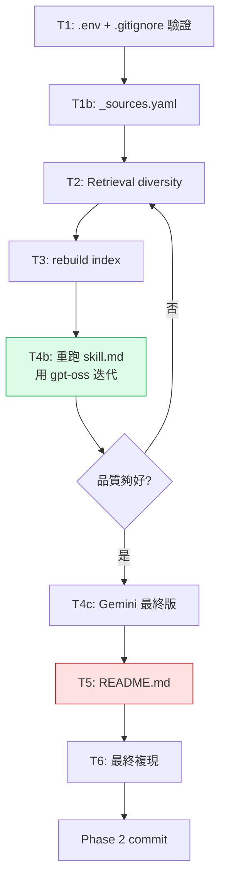

# Software Design Document — Phase 2 (v1.1)
## HW3 — `startup-trends-rag`: Finalization & Knowledge Distillation

> **Document status**: v1.1 — revised after first auto-generated `skill.md`
> **Prerequisite**: Phase 1 SDD (architecture), Phase 1 implementation complete
> **Target deadline**: 2026/4/21 23:59
> **Last updated**: 2026-04-09
>
> **Changes from v1.0**:
> - §1 state snapshot updated after Phase 1 commit + first real `skill.md` run
> - §6 Task 4 rewritten: `skill.md` is no longer "recreate from scratch" but
>   "review, fix retrieval issues observed in output, regenerate"
> - §1.3 defect list trimmed — `.gitignore` done, skill.md auto-gen done
> - README.md (§7) promoted to **highest-priority remaining task**

---

## 0. 文件定位

這是 SDD 的 **Phase 2 修訂版**,v1.0 針對「尚未跑過 skill_builder」的狀態規劃,v1.1 則是基於**第一次真實產出的 `skill.md`** 所揭露的具體品質問題進行修正。

---

## 1. Phase 1 現況盤點(v1.1 更新)

### 1.1 已完成項目 ✅

| 元件 | 檔案 | 狀態 |
|---|---|---|
| Repo 骨架 | `config.py`, `docker-compose.yml`, `docker/init.sql`, `requirements.txt` | ✅ |
| 爬蟲 | `scripts/crawler.py` | ✅ 完成,抓到 23 篇 |
| 索引 pipeline | `data_update.py`(SHA256 idempotency + HNSW index) | ✅ |
| 查詢介面 | `rag_query.py`(retrieval + LiteLLM + 引用 + multi-turn) | ✅ |
| **知識萃取** | `skill_builder.py` + **實際產出 `skill.md`(16,844 字元)** | ✅ **v1.1 新增** |
| **`.gitignore`** | 含 `docker/pgdata/`, `.env`, `__pycache__/` | ✅ **v1.1 新增** |
| 資料量 | `data/raw/crawled/`: 23 + `data/raw/manual/`: 11 = **34 份** | ✅ |

### 1.2 Phase 1 CI 預期結果

所有 7 項檢查項目應通過:data/rag_query/requirements/.env.example 都在,`data/` 34 份 >> 5 門檻,`.env.example` 無真實 key pattern,兩支 `--help` 可執行。**Phase 1 可以繳交。**

### 1.3 Phase 2 CI 預期結果(目前狀態)

| 檢查項目 | 狀態 |
|---|---|
| `skill_builder.py` 存在 | ✅ |
| `skill.md` > 500 字元 | ✅ (16,844 字元) |
| **`README.md` > 1000 字元** | ❌ **完全缺失** |
| `data/` ≥ 20 檔案 | ✅ (34 份) |
| `python skill_builder.py --help` 不報錯 | ✅ |
| `skill.md` 含必要章節關鍵字(`## Overview`、`## Core Concepts`、`## Source References`) | ✅ 全部存在 |

**剩下的硬阻塞只有 README.md。** 其他都是品質優化。

### 1.4 從第一次 `skill.md` 輸出觀察到的問題

這是 v1.1 新增的章節 — 有了真實產出後,可以具體指出 retrieval/content 層級的缺陷:

**問題 A:部分章節答非所問,顯示 retrieval 打歪**

- **Core Concepts** 第一句就寫「There is no explicit mention of new emerging concepts, frameworks, or mental models...」然後退而求其次給了一些 Startup Genome 的指標定義(20% early-stage 成功率等)。這表示 global question 問的「emerging frameworks」對應的 chunks 沒被撈到 — 很可能 a16z、Sequoia 那些真正講 frameworks 的 chunks 被 PitchBook 數據 chunks 淹沒了
- **Methodology & Best Practices** 不正常地聚焦在「Saudi Arabia venture building」 — 這是 Startup Genome 報告中的一個 local case study,不應該被當成全域方法論。這是 retrieval 單一來源霸佔的典型症狀
- **Knowledge Gaps** 章節的內容本身講的是「Startup Genome 報告本身有哪些未涵蓋」,而不是整個知識庫的 gap — LLM 把問題誤解了

**問題 B:Source References 有 11 份 PDF 沒有 URL**

直接從 Source References 區塊就能看到:
```
-   **CB-Insights_Venture-Report-2024**      ← 無 URL
-   **Stripe Annual Letter**                 ← 無 URL
-   **Bessemer State of the Cloud 2024**     ← 無 URL
-   ... (共 11 份)
```
這呼應了 v1.0 就指出的「PDF metadata 缺 source_url」問題,必須修。

**問題 C:內容品質有不一致**

好的部分很好:
- Key Entities 段非常強,有具體的公司計數(「Andreessen Horowitz: 46 companies, General Catalyst: 44...」),顯然 LLM 從 CB Insights 報告撈到了正確的表格數據
- Example Q&A 對 AI 新創風險的回答很紮實,引用了 7 個具體 risk factors

不好的部分:
- Overview 段引用了 Startup Genome 的「Saudi Arabia」地區性觀察當作全局敘述
- 第二個 Example Q&A(bootstrap vs VC)直接放棄,說「context does not directly advise」— 這題確實是知識庫的真 gap,但同一個 LLM 也本該能從 Paul Graham essays、Sam Altman 文章給出觀點。retrieval 沒打到那些來源

**這三類問題的共同根因**:retrieval diversity 不足 + PDF metadata 缺失。前者讓 Startup Genome(它在向量空間中的「資料分析」語意剛好很容易 match 很多 global questions)霸佔太多 top-k slot,後者讓 Source References 看起來不專業。

---

## 2. Phase 2 剩餘工作

### 2.1 優先級調整(v1.1)

v1.0 的 T4「重寫 skill.md」已經完成,但發現需要**迭代改善**。優先級重新排列:

| 優先級 | Task | 內容 | 預估工時 |
|---|---|---|---|
| **P0** | T5 | 撰寫 `README.md` | 2–3 小時 |
| **P0** | T1 | `.env.example` 更新(v1.0 §3.2)+ `git rm --cached docker/pgdata/` | 15 分鐘 |
| **P1** | T1b | 加 `_sources.yaml` 修 PDF metadata(v1.0 §3.4) | 30 分鐘 |
| **P1** | T2 | Retrieval diversity(per-doc cap) | 45 分鐘 |
| **P1** | T4b | **重跑 skill.md,用改善後的 retrieval** | 30 分鐘 |
| P2 | T4c | 用 Gemini key 跑最終版 | 5 分鐘 |
| **P0** | T6 | 最終複現驗證 | 1 小時 |

**總工時:5–6 小時**,比 v1.0 少了約 2 小時(因為 skill.md 主體已完成)。

### 2.2 工作排序建議



**為什麼 README 放在最後而不是最前**:README 的「設計決策」章節需要反映 retrieval diversity 等最終設計,先把技術改好再寫 README 才不會寫完又改。但 **README 的大綱可以一開始就先擬草稿**,邊做 T1–T4 邊累積內容。

---

## 3. Task 1 — 清理與補強(部分已完成)

### 3.1 ✅ `.gitignore` 建立 — 已完成

你現在的 `.gitignore`:
```
.venv/
__pycache__/
*.pyc
.env
docker/pgdata/
crawler_errors.log
.DS_Store
```

✅ 最重要的三項 `docker/pgdata/`、`.env`、`__pycache__/` 都在。

**剩下要做**:確認 git 狀態

```bash
# 檢查 pgdata 是否已被追蹤(從歷史 commit)
git ls-files docker/pgdata/

# 如果有輸出 → 已被追蹤,立刻移除
git rm -r --cached docker/pgdata/
git commit -m "Untrack docker/pgdata"

# 確認沒有 .env 被追蹤
git ls-files .env
# 應該沒有任何輸出
```

### 3.2 🔴 `.env.example` 重寫 — **P0 必做**

你目前的 `.env.example` **仍是過時版本**:

```dotenv
# LiteLLM (provided by instructor on 4/14)    ← 4/14 早過了
LITELLM_API_KEY=your_api_key_here              ← config.py 實際讀 OPENAI_API_KEY
LITELLM_BASE_URL=https://your-litellm-endpoint/
```

與實際 config.py 讀取行為、與助教實際提供的端點、與 `.env` 實際內容都不一致。**用以下版本完全替換**(不含任何 `sk-` pattern):

```dotenv
# =============================================
# LiteLLM Proxy (NCKU taica course endpoint)
# =============================================
# LiteLLM proxy is OpenAI-compatible, so we use OPENAI_* env vars
# together with the "openai/" model prefix in code.
# config.py also accepts LITELLM_API_KEY / LITELLM_BASE_URL as aliases
# for backward compatibility.
OPENAI_API_BASE=https://litellm.netdb.csie.ncku.edu.tw

# Choose ONE of the three keys below by uncommenting, based on your use case:

# --- Development key: gpt-oss:20b (unlimited, slower) ---
# TAICA_loc_openai team — best for iteration and debugging
OPENAI_API_KEY=sk-REPLACE_WITH_YOUR_TAICA_LOC_OPENAI_KEY

# --- Development key: gemma4 (unlimited) ---
# TAICA_local_gamma4 team — alternative local model
# OPENAI_API_KEY=sk-REPLACE_WITH_YOUR_TAICA_LOCAL_GAMMA4_KEY

# --- Production key: gemini-2.5-flash ($3 budget, highest quality) ---
# TAICA_gemini team — use for final skill.md generation
# OPENAI_API_KEY=sk-REPLACE_WITH_YOUR_TAICA_GEMINI_KEY

# =============================================
# Model selection
# =============================================
# Values must carry the "openai/" prefix (routes via LiteLLM OpenAI-compatible path):
#   openai/gpt-oss:20b        ← matches gpt-oss key
#   openai/gemma4             ← matches gemma4 key
#   openai/gemini-2.5-flash   ← matches gemini key
RAG_DEFAULT_MODEL=openai/gpt-oss:20b

# =============================================
# Embedding (local sentence-transformers, no key needed)
# =============================================
EMBEDDING_MODEL=sentence-transformers/all-mpnet-base-v2
EMBEDDING_DIM=768

# =============================================
# pgvector
# =============================================
PGVECTOR_HOST=localhost
PGVECTOR_PORT=5432
PGVECTOR_USER=raguser
PGVECTOR_PASSWORD=ragpassword
PGVECTOR_DB=ragdb

# =============================================
# RAG defaults
# =============================================
RAG_TOP_K=5
```

### 3.3 🟡 `config.py` 預設值修正 — 建議做

`config.py` 第 68 行:
```python
RAG_DEFAULT_MODEL: str = os.getenv("RAG_DEFAULT_MODEL", "gemini-2.5-flash")
```

預設值缺 `openai/` 前綴。助教若沒設 `RAG_DEFAULT_MODEL` 環境變數,程式會試圖打 Google 原生 Gemini API 然後因為沒 `GEMINI_API_KEY` 而炸。改成:

```python
RAG_DEFAULT_MODEL: str = os.getenv("RAG_DEFAULT_MODEL", "openai/gpt-oss:20b")
```

### 3.4 🟡 `_sources.yaml` 補 PDF metadata — 建議做

**這直接影響新版 `skill.md` 中 11 份 PDF 的 Source References 可追溯性。**(從你的 skill.md 可以看到「CB-Insights_Venture-Report-2024」等 11 份條目下方沒有 URL)

設計與 v1.0 §3.4 相同:在 `data/raw/manual/` 建立 `_sources.yaml`,`data_update.py` 讀取後填入 metadata。完整內容見 v1.0 SDD §3.4,這裡不重複。

**加到 requirements.txt**:
```
pyyaml==6.0.1
```

**修改 `data_update.py`**:在頂部加入 `import yaml` 和 `load_manual_metadata()` 函式,在 `process_file()` 的 PDF 分支後補 metadata(程式片段見 v1.0 SDD §3.4)。

---

## 4. Task 2 — Retrieval Diversity(v1.1 調整)

### 4.1 為什麼這次一定要做

v1.0 把 diversity 列為「建議做」。v1.1 基於實際 `skill.md` 輸出結果,**升格為 P1 必做** — 因為你看到:

- Methodology 章節被 Startup Genome 的 Saudi Arabia 敘述霸佔
- Core Concepts 的 12 個 bullet 中有 5 個來自同一份 Startup Genome 報告
- 同一個 global question 的 top-8 chunks 中有 4–6 個來自同一份 PDF

這些不是巧合,這是向量空間中「Startup Genome 那份報告的文字風格(大量數據定義、專業術語)」在很多 query 下都有中等相似度,所以穩定排進 top-k。解法就是強制限制 per-document 佔比。

### 4.2 實作(Per-Document Cap)

實作方式與 v1.0 §4.1 相同。摘要:

**在 `rag_query.py` 新增**:

```python
from collections import defaultdict

MAX_CHUNKS_PER_DOC: int = 2

def diversify_by_document(
    chunks: list[dict],
    top_k: int,
    max_per_doc: int = MAX_CHUNKS_PER_DOC,
) -> list[dict]:
    """Ensure no single document contributes more than max_per_doc chunks."""
    counts: dict[str, int] = defaultdict(int)
    result: list[dict] = []
    for c in chunks:  # already ordered by similarity desc
        key = c.get("title") or c.get("source_url") or "unknown"
        if counts[key] >= max_per_doc:
            continue
        counts[key] += 1
        result.append(c)
        if len(result) >= top_k:
            break
    return result
```

**修改 `query()` 函式**:

```python
def query(user_question, conn, top_k=RAG_TOP_K, ...):
    q_vec = embed_query(user_question)
    raw_chunks = pgvector_search(conn, q_vec, top_k=top_k * 3)  # over-fetch
    chunks = diversify_by_document(raw_chunks, top_k=top_k)     # diversify
    # ... rest unchanged
```

**參數選擇理由**(寫進 README 設計決策):
- `over_fetch = top_k * 3`:保留足夠候選讓 diversity filter 有東西可選。3 倍是業界經驗值,再高會引入太多低相關性 chunks
- `max_per_doc = 2`:允許一份文件貢獻到核心論點 + 支撐論點,但不能霸佔整個上下文。若設 1 會過度稀釋核心權威來源的影響力

### 4.3 驗證方法

修改後跑兩個 query 對照:

```bash
# 一般查詢
python rag_query.py --query "What are 2025's hottest AI verticals?"

# skill_builder 會問的那種全域問題
python rag_query.py --query "What best practices or methodologies do experienced VCs recommend?" --top-k 8
```

**成功標準**:
- 第一個 query 的 Sources 表中,Q4-2025-pitchbook 出現次數從 3 降到 ≤ 2
- 第二個 query 的 Sources 表中,Startup Genome / gser-2025 出現次數從 5+ 降到 ≤ 2

---

## 5. Task 3 — 重建索引

完成 T1(`_sources.yaml`)+ T2(diversity)後,重跑全量索引:

```bash
docker compose up -d
python data_update.py --rebuild

# 冪等性驗證(評分 15%)
python data_update.py              # 應顯示 0 new / 0 changed / 0 deleted
python data_update.py --dry-run    # 同上

# 檢查 PDF metadata 是否有進 DB
docker exec -it hw3-pgvector psql -U raguser -d ragdb -c \
  "SELECT title, source_url FROM documents WHERE source_type='pdf';"
```

**成功標準**:11 份 PDF 的 `source_url` 欄位都應有值。

---

## 6. Task 4 — 迭代 `skill.md`(v1.1 重寫)

### 6.1 v1.0 vs v1.1 的差異

| v1.0 目標 | v1.1 目標 |
|---|---|
| 從無到有產出 `skill.md` | 改善已有的 `skill.md` 的 retrieval 品質問題 |
| 驗證 skill_builder 流程能跑 | 驗證 per-doc diversity 是否解決了霸佔問題 |
| 基準線 | 目標:對比 v1.0 產出,觀察三個問題章節是否改善 |

### 6.2 目前 `skill.md` 已經做對的部分(保留)

這些不要改,確認在新版仍維持:

- **Overview**: 有具體數字(Cleantech -40%, Edtech -57%, venture debt $61.1B)和引用
- **Key Trends**: 2024/2025/2026 逐年敘述、AI sub-sectors 有具體資訊
- **Key Entities**: 公司計數列表非常詳細(這段是 skill.md 的亮點)
- **Example Q&A 第一題**: AI 新創風險的 7 個因素有紮實結構

### 6.3 v1.1 要修正的 3 個具體問題

**問題 A:Core Concepts 答非所問**

目前輸出:「There is no explicit mention of new emerging concepts, frameworks, or mental models...」(LLM 放棄了)

**根因**:Global question 問「emerging concepts, frameworks, mental models」,這種語意在向量空間中偏抽象,打不到 a16z / Sequoia / Paul Graham 那些講 frameworks 的具體 chunks,反而撈到 Startup Genome 的 metric 定義。

**解法選項**(do one):
1. **調整 global question** — 改成更具體的措辭,例如:「What specific evaluation frameworks, mental models, or investment heuristics do leading VCs like a16z, Sequoia, or Y Combinator alumni articulate in their writings?」— 把「VC 名稱」嵌進 query,會讓 embedding 在該語意空間中得到 boost
2. **拆成兩個問題** — 一個問 VC frameworks,一個問 founder mental models,分別 retrieve

**建議**:兩個都做。把現有 3 個 Core Concepts 問題增加為 4 個,把第一個改得更具體。

**問題 B:Methodology 被 Saudi Arabia 霸佔**

目前輸出:`Venture Building Methodology ... in high-growth markets like Saudi Arabia, venture building (by studios) is noted to outperform accelerators...`

**根因**:Startup Genome 報告裡對「venture building methodology」有非常直接的敘述,該 chunk 的向量與 query「best practices methodologies」幾乎完美匹配,又沒有 per-doc cap,所以霸佔了 top-k。

**解法**:T2 的 per-doc cap 會直接解決。T2 做完後,這段會自動改善。額外也可以微調 global question 讓它更強調「founder/VC best practices」而非「ecosystem methodology」。

**問題 C:Knowledge Gaps 誤解問題**

目前輸出在講「Startup Genome 報告本身有哪些內容沒涵蓋」,而非「整個知識庫的 gap」。

**根因**:Global question 說「What aspects of the early-stage startup landscape are NOT well covered in the available sources?」— LLM 把「available sources」理解成了「這份 source(單一 PDF)」而非「整個知識庫」。再加上 retrieval 全撈到同一份 PDF 的相鄰 chunks,強化了這種誤解。

**解法**:
1. T2 per-doc cap 會讓 retrieval 更分散,減少「被單一來源誤導」
2. 改 global question 為:「Looking across all the indexed sources, what important topics about early-stage startup investment remain under-discussed or absent? Consider what a complete knowledge base should cover but this corpus does not.」— 明確說 across all sources 且 consider what's missing

### 6.4 執行順序

```bash
# 前置:T1 + T2 + T3 都做完

# Step 1: 更新 skill_builder.py 的 GLOBAL_QUESTIONS
# 把問題 A 的第一個 Core Concepts query 改具體
# 把問題 C 的 Gaps query 改具體
# (Core Concepts 可選加到 4 個,或維持 3 個只改第一個)

# Step 2: 用 gpt-oss 跑一次做對比
python skill_builder.py --output skill_v2_oss.md

# Step 3: 肉眼檢查三個問題章節是否改善
# 特別看:
#   - Core Concepts 有沒有引用 a16z / Sequoia / Paul Graham
#   - Methodology 有沒有脫離 Saudi Arabia 霸佔
#   - Knowledge Gaps 有沒有改談全局(而非單一 PDF)

# Step 4: 滿意後切 Gemini key 跑最終版
# 編輯 .env: 註解 gpt-oss key,解註 gemini key
# 改 RAG_DEFAULT_MODEL=openai/gemini-2.5-flash
python skill_builder.py --output skill.md --model openai/gemini-2.5-flash

# Step 5: 備份 v1 產出做 git diff 對照(可選,展示迭代過程)
```

### 6.5 品質評估 checklist

對最終 `skill.md` 逐項檢查:

- [ ] Overview 不到 300 字但有具體數字與 VC 名稱
- [ ] Core Concepts 至少 5 項,至少 2 項引用非 PitchBook/Startup Genome 的來源
- [ ] Key Trends 有時間結構(2024/2025/2026)和具體數據
- [ ] Key Entities 有公司排名(已有,保留)
- [ ] Methodology 不被單一 PDF 霸佔
- [ ] Knowledge Gaps 是對整個知識庫的 meta 反省,不是某份報告的缺失
- [ ] Example Q&A 兩題都有實質回答
- [ ] Source References 34 份全有 URL(T1b 修好後)
- [ ] 總長度 > 10,000 字元(目前已 16,844,應維持)

---

## 7. Task 5 — 撰寫 `README.md`(**P0 最高優先級**)

### 7.1 為什麼是最高優先級

- Phase 2 CI 硬阻塞(> 1000 字元)
- 15% 評分項「README 設計決策深度」
- 目前檔案 **完全不存在**

### 7.2 撰寫策略

**不要等 T1–T4 全做完才開始寫**,改用交錯策略:

1. **現在**(做 T1 前):先建立 `README.md` 骨架 + Mermaid 圖 + 「專案簡介」章節
2. **T1 做完後**:補「環境設定與執行方式」章節(最關鍵的複現章節)
3. **T2 做完後**:補「設計決策 — Retrieval Strategy」小節
4. **T4 做完後**:補「資料來源聲明」表格(要依真實 Source References 填)
5. **T6 做完後**:補「系統限制與未來改進」章節(誠實反映實測問題)

### 7.3 章節大綱(與 v1.0 §7.2 相同但順序調整)

v1.0 §7.2 的六節大綱依然適用,這裡不重複完整內容。只補一點 v1.1 的新素材 —

**「設計決策 — Retrieval Strategy」段必須寫 Per-Doc Cap 的故事**:

> 初版實作僅使用原生 pgvector top-k 檢索,但在跑完第一次 `skill_builder.py`
> 後觀察到明顯的「單一來源霸佔」現象:當全域問題問及 methodology 時,
> Startup Genome 報告的相鄰 chunks 會佔據整個 top-k,導致生成的 skill.md
> 中 Methodology 章節錯誤地聚焦於 Saudi Arabia 地區性案例。
>
> 為此引入 **Per-Document Diversity Cap**:SQL 端 over-fetch top_k * 3 個
> 候選,然後在 Python 端強制每份文件最多貢獻 2 個 chunks。這個策略的
> 優勢是實作輕量(< 20 行程式碼)、零額外依賴,且對已觀察到的問題有
> 直接對應的修復效果。
>
> 未來可進一步升級為 MMR(Maximal Marginal Relevance)reranking,用
> λ 參數在相關性與多樣性間做更細緻的權衡,或加入 cross-encoder
> reranker(如 `BAAI/bge-reranker-base`)做 secondary ranking,但當前
> 設計對本作業的資料規模(34 份文件、數百個 chunks)已足夠。

**「系統限制與未來改進」段必須寫你從 skill.md 實測發現的真限制**:

> **已知限制**(基於第一次 `skill.md` 產出的實測觀察)
>
> 1. **部分全域問題對抽象概念的 retrieval 品質不穩定**:例如問「emerging
>    frameworks and mental models」時,LLM 會傾向撈到具體的指標定義而非
>    真正的 framework 敘述。已透過調整 global question 措辭(嵌入具體 VC
>    名稱)緩解,但根本解法是 query rewriting / HyDE
>
> 2. **PDF metadata 依賴手動維護的 `_sources.yaml`**:若未來要擴展到更多
>    手動下載的報告,每新增一份都要手動維護。可改用工具如 grobid 從 PDF
>    metadata 自動擷取
>
> 3. **...**(其他照寫 v1.0 列的 limitations)

這樣的誠實紀錄對 AI 評分會得分 — 評分項「README 設計決策深度」的核心是「個人化的工程思路是否清晰」,真實觀察 + 真實修復 >> 教科書套話。

### 7.4 長度目標

- 最少 3,000 字元(CI 門檻的 3 倍)
- 理想 5,000–8,000 字元
- 設計決策章節佔 40%(2,000–3,000 字元)

---

## 8. Task 6 — 最終複現驗證

與 v1.0 §8 相同,不重複。強調一點:**在修了 `.env.example` 之後,務必在一個全新的 shell 跑一次 `cp .env.example .env; nano .env; python rag_query.py --query "test"`**,確認你寫進 `.env.example` 的 key 名稱(`OPENAI_API_KEY` / `OPENAI_API_BASE`)與 `config.py` 讀取行為一致。

這是很容易漏的驗證:v1.0 建議用 `OPENAI_*`,而 `config.py` 有 `or` fallback 兩邊都支援,但如果你寫 `.env.example` 時只寫 `OPENAI_*`、`.env` 實際也只設 `OPENAI_*`,則必須確認 `config.py` 的 fallback 邏輯正確。從你現在的 `config.py` 第 53–62 行看是對的(先讀 LITELLM,再 or 到 OPENAI),OK。

---

## 9. 風險更新(v1.1)

| 風險 | v1.1 狀態 |
|---|---|
| skill.md 跑不出來 | ✅ 已消除 — 第一次產出成功 |
| Docker pgdata 被 commit 污染 repo | 🟡 `.gitignore` 已加,但要驗證 git 追蹤狀態 |
| README 寫太趕 | 🔴 **新增主要風險** — 佔 15% 且完全缺失,**最早開始、最晚完成** |
| Gemini 額度用完 | 🟢 極低 — gpt-oss 已能跑出 16K 字的 skill.md,Gemini 只需 1–2 次最終版 |
| skill.md retrieval 品質不達標 | 🟡 已知問題,解法明確(T2 + T4) |

---

## Appendix A — v1.1 更新後的 Checklist

### P0 必做
- [ ] 驗證 `git ls-files docker/pgdata/` 無輸出(或 `git rm --cached` 之)
- [ ] 重寫 `.env.example`(§3.2 完整版)
- [ ] 建立 `README.md`(§7,至少 3000 字元)

### P1 強烈建議
- [ ] 修 `config.py` 第 68 行預設值加 `openai/` 前綴
- [ ] 建 `data/raw/manual/_sources.yaml` 補 11 份 PDF metadata
- [ ] `data_update.py` 加 `load_manual_metadata()` 邏輯
- [ ] `requirements.txt` 加 `pyyaml==6.0.1`
- [ ] `rag_query.py` 加 `diversify_by_document()` 函式
- [ ] 修改 `skill_builder.py` 的 global questions(§6.3 的問題 A 和 C)
- [ ] 重跑 `data_update.py --rebuild`
- [ ] 重跑 `skill_builder.py`(先 gpt-oss 驗證品質,後 gemini 最終版)
- [ ] 肉眼檢查新 `skill.md` 的三個問題章節是否改善

### P0 繳交前
- [ ] `grep "sk-" .env.example` 無輸出
- [ ] `ls README.md skill.md data_update.py rag_query.py skill_builder.py requirements.txt .env.example .gitignore` 全部存在
- [ ] `wc -c README.md` > 1000
- [ ] `wc -c skill.md` > 500
- [ ] `ls data/raw/crawled data/raw/manual | wc -l` ≥ 20
- [ ] 在 fresh conda env 跑一次完整 README 指令流程

---

*End of SDD Phase 2 — v1.1*
